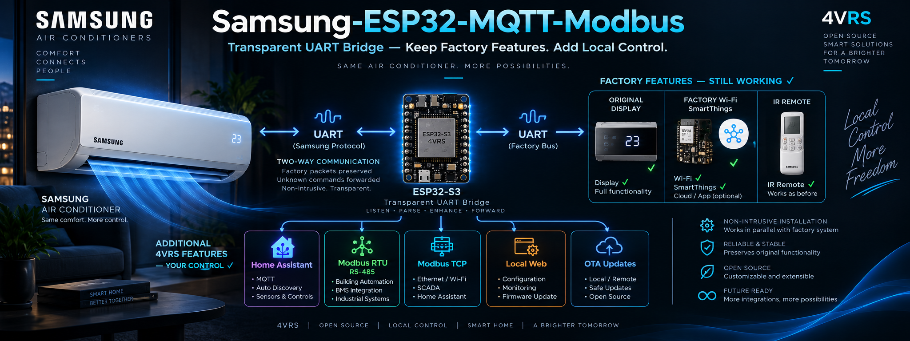
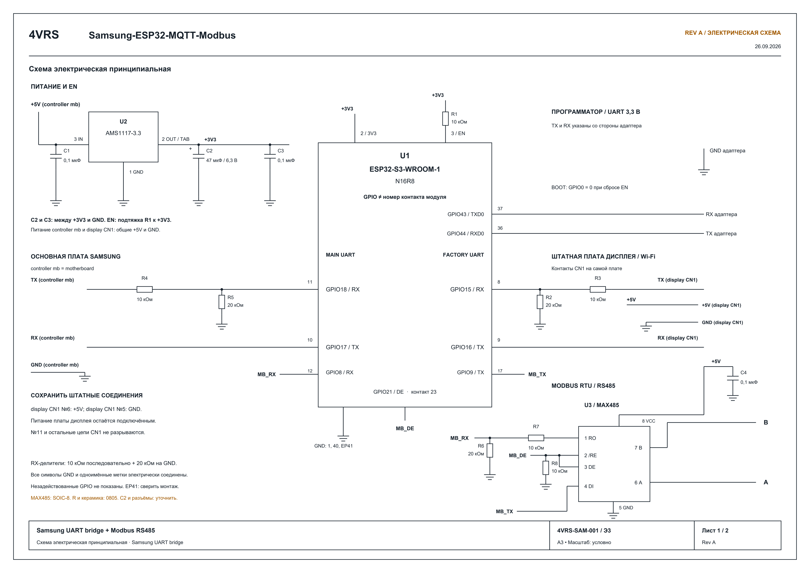

# Samsung-ESP32-MQTT-Modbus — 1.0.2

[Русский](README_RU.md)

**[Download stable v1.0.2](https://github.com/dk-1983/Samsung-ESP32-MQTT-Modbus/releases/tag/v1.0.2)** — ready-made OTA binary for already provisioned ESP32-S3 N16R8 controllers. Not a first-install image for a blank board.

**Keep Samsung's factory features and add 4VRS control.**

Samsung-ESP32-MQTT-Modbus is an ESP32-S3 expansion controller with a transparent
inline UART bridge between the AC motherboard and its original display/Wi-Fi board.
The architecture is designed to preserve the full factory functionality: the
original boards keep communicating, while the IR remote, display and Samsung
SmartThings coexist with the additional 4VRS interfaces.

Our 4VRS polling and command dispatcher runs on the ESP32. It tracks factory
transactions, selects an idle window for each own request and coordinates access
from the web controls, MQTT and Modbus to the shared UART bus. A command is confirmed
only by reading the actual AC state. Unknown factory packets are forwarded unchanged,
so forwarding is not limited to the commands implemented by our firmware.

Additional interfaces:

- **Wi-Fi:** local network connectivity and OTA firmware updates.
- **HTTP Remote:** a local web remote and HTTP API for control over the network.
- **MQTT / Home Assistant Discovery:** automatic device and entity discovery. No custom Samsung/4VRS integration, HACS package or manual entity configuration is required; use the standard MQTT integration with your broker.
- **Modbus RTU / TCP:** RS485 and network automation integration.

Local 4VRS interfaces do not require Samsung's cloud. Factory SmartThings retains
its own connection through the original Wi-Fi module. Display, IR remote and
SmartThings control have been checked with the bridge on AR24BSFCMWKNER;
exhaustive validation of every factory function is still pending.

Repository: [dk-1983/Samsung-ESP32-MQTT-Modbus](https://github.com/dk-1983/Samsung-ESP32-MQTT-Modbus).
See [bridge wiring and limitations](docs/UART_BRIDGE.md).

Home Assistant is optional: connect the controller to your own MQTT broker and automation server. See [topics, commands, states and the complete Discovery-based inventory](docs/HOME_ASSISTANT.md#own-mqtt-broker-without-home-assistant).

[Complete Modbus register list with Samsung / 4VRS separation](docs/MODBUS.md): the factory indoor-unit range ends at **2449**, and our extensions begin at **2450**.

[Electrical schematic, wiring and PCB component libraries](hardware/README.md).

## Home Assistant via Modbus Devices

**[Modbus Devices](https://github.com/dk-1983/Modbus_Devices#4vrs) includes a dedicated profile for this controller: manufacturer `4VRS`, model `Samsung-ESP32-Modbus`.**

Connect through Modbus TCP over Wi-Fi or Modbus RTU over RS485 to get climate
control, the full fan/swing/preset controls, confirmed writes, and link and command
diagnostics in Home Assistant. The profile uses our extended register map;
you do not need to enter each register manually. MQTT is not required for this option.

1. Install [Modbus Devices](https://github.com/dk-1983/Modbus_Devices#installation) in Home Assistant.
2. Open `/modbus` on the controller and enable TCP or RTU.
3. Add the device using **4VRS → Samsung-ESP32-Modbus** and your connection settings.
   For direct TCP, use the controller IP, port **502** and configured Unit ID (default **1**).
   For RTU, match the controller's serial settings (default **9600 8E1**).

Select the **4VRS** profile for this device; the Samsung **MIM-B19N(T)** profile
is for the factory adapter. For MQTT-based setup, use Home Assistant's standard
MQTT integration with Discovery as described above.

## Electrical schematic

Motherboard UART: **RX18 / TX17**. Original display/Wi-Fi board: **RX15 / TX16**.
Modbus RS485: **RX8 / TX9 / DE21**. Numbers are ESP32 GPIOs, not module pad numbers.
Both Samsung boards retain their +5 V and common ground connections.

[Open full-resolution schematic](hardware/drawings/preview-1.png) · [Vector PDF](hardware/drawings/Samsung_transparency_bridge_revA-review.pdf) · [PCB component libraries](hardware/README.md)

## Controls and connections

The portal on port 80 links to controls, MQTT, Modbus and GitHub updates.
The Control link opens `/control`; advanced ESPHome controls remain on port 8080.
Both use `admin` and the same password stored on the device.

The main web interface on port 80 supports English and Russian. English is the
default; use the language selector to switch. Your browser remembers the selection.
This selector does not change the advanced ESPHome interface on port 8080.

- Independent persistent checkboxes for MQTT, Modbus RTU and Modbus TCP; all default off.
- Browser-configured MQTT broker/port/credentials/topic prefix and Home Assistant discovery.
- Browser-configured Modbus unit and RS485 baud rate; RTU defaults to 9600 8E1, TCP port 502.
- GitHub automatic-install checkbox, manual check/install, progress, signed manifest,
  board profile, SHA256 validation and rollback.
- Local ESPHome OTA remains available and is coordinated with the GitHub worker.

[Management and releases](docs/MANAGEMENT.md) · [Full device register map](docs/MODBUS.md)
· [Home Assistant MQTT Discovery](docs/HOME_ASSISTANT.md)
· [Modbus register reference (Russian)](docs/MODBUS_REGISTERS_RU.md)
· [UART function reference](docs/FUNCTIONS_RU.md)

UART TX/RX GPIO17/18 uses 9600 8N1. RS485 TX/RX/DE uses 9/8/21.
The AC uses D0 UART, not native Modbus; ESP32 implements the external register map.
Core addresses follow MIM-B19N/B19NT; custom functions begin at 2450.

UART is enabled on every boot and can be disabled in the control page.
Saving MQTT settings reboots the controller after two seconds to apply credentials.
Feedback is never optimistic: acknowledgement is not proof of the requested AC state.

## Hardware compatibility, first installation and updates

**Inline bridge support starts with firmware 0.5.0. Versions 0.4.x use the earlier
non-bridge configuration; 0.5.0 and later target the bridge wiring shown here.**
From the ESP32 side, the AC motherboard uses RX GPIO18 / TX GPIO17, the original
Wi-Fi/display board uses RX GPIO15 / TX GPIO16, and Modbus RS485 uses
RX GPIO8 / TX GPIO9 / DE GPIO21.
Module pads 8/9 are GPIO15/16 (the bridge), not GPIO8/9 (Modbus).

Boards wired for the pre-0.5.0 non-bridge configuration are a different hardware
configuration.
Do not install the current OTA on them solely because their firmware version is
older. Check the wiring against the current schematic first; an OTA update does
not add the missing bridge connection or change the PCB routing.

- **Configured controller with the current bridge wiring:** update through
  `/updates`. A working 1.0.0 or 1.0.1 installation on this hardware can update
  directly; no intermediate version is required. Preserve NVS when updating.
- **New controller with the current bridge wiring:** build the current stable
  source with `./Build.ps1`, personal `secrets.yaml` and `public_release: "false"`
  (the default). Use `firmware.factory.bin` for initial USB/serial installation.
  First boot saves the web, local OTA and Samsung-Setup passwords in NVS.
  Connect to Samsung-Setup with your setup password and configure Wi-Fi at
  `http://192.168.4.1:8080/`. Subsequent updates can use public OTA releases.

The public `*-ota.bin` requires existing device credentials in NVS; it is not a
first-install image for a blank board. A ready-made public provisioning image is
not provided yet. Installing an old firmware version first is not required.
Hardware compatibility and initial credential provisioning are separate requirements.

## Build and validation

Run `./Build.ps1` to install pinned dependencies, run host tests and build, without
flashing. Local configuration is in `secrets.yaml`; neither it nor locally built
private binaries belong in a public release. OTA/factory binaries are under
`work/build/.pioenvs/samsung-s3`. On the first local build boot, credentials are saved
to NVS and survive subsequent public OTA updates.

The separate GitHub workflow prepares a clean public **OTA-only** artifact for
controllers with the current bridge wiring and provisioned credentials. Signing/publishing is a separate step.
See [release preparation](docs/MANAGEMENT.md#release).

Power, fan Low/Medium/High/Turbo and both swing axes were tested on the target AC
in earlier firmware. Persistent web settings, Modbus TCP and GitHub OTA have
been checked on a device, including credential/settings retention and boot confirmation.
Authenticated MQTT connectivity is verified. Physical RS485 and forced rollback still need testing.
Experimental legacy controls require per-function verification on this model.

[Protocol](docs/PROTOCOL.md) · [Attribution](THIRD_PARTY.md)

The `/about` page shows firmware, memory, connections and UART freshness.
Restart requires confirmation and preserves settings. It is rejected during OTA
or while an AC command is pending.

`/settings` independently changes web, local OTA and Samsung-Setup passwords.
Blank fields preserve current credentials; new values require confirmation.
Changes are stored in NVS and applied on restart. Forgotten-password recovery
is not implemented yet.

`/wifi` shows network, IP, MAC, signal and channel. `/wifi/reset` confirms a
Wi-Fi-only reset; reprovision through Samsung-Setup at `192.168.4.1:8080`.
Other settings are preserved.

[Overview, web controls and MQTT power commands (Russian)](docs/CONTROL_RU.md).

HVAC commands require fresh control permission and feedback. Requested power is
never restored automatically after a restart.

In inline mode the factory board owns startup and notification ACKs. Own writes
require fresh permission and feedback, use an idle transaction window and are
confirmed by own readback, never by ACK alone. No automatic write retries.
Main RX18/TX17, factory RX15/TX16, RS485 RX8/TX9/DE21. All three hardware
UARTs are used; serial logging is disabled, web logging remains available.
Disabling UART transmission also stops factory forwarding.
