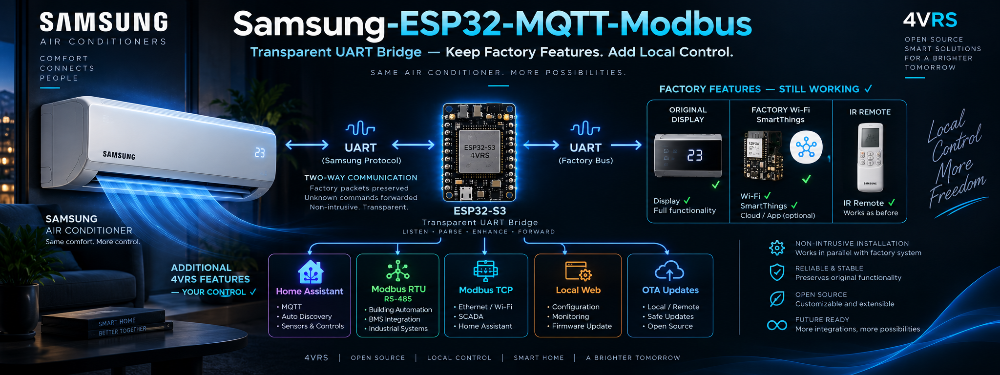
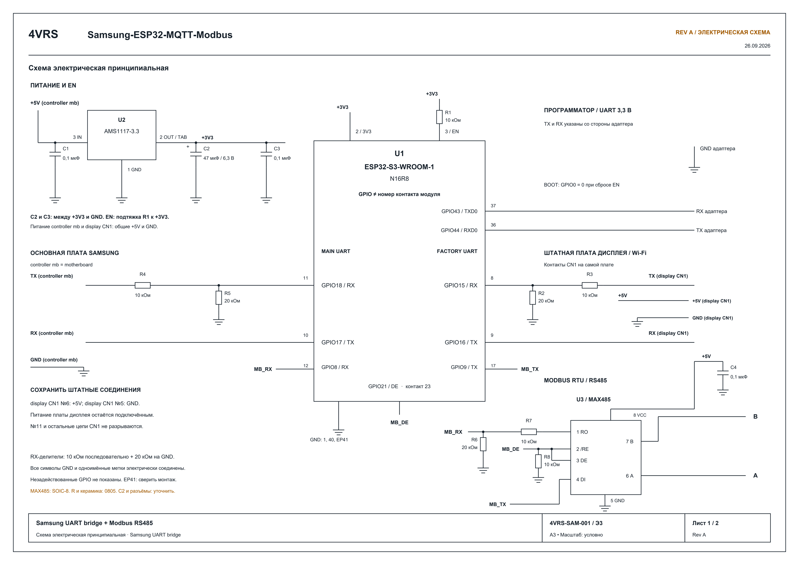

# Samsung-ESP32-MQTT-Modbus — 0.5.0

[English](README.md)

**[Скачать v0.5.0](https://github.com/dk-1983/Samsung-ESP32-MQTT-Modbus/releases/tag/v0.5.0)** — готовый OTA-бинарник для уже настроенных контроллеров ESP32-S3 N16R8. Не предназначен для первой прошивки пустой платы.

**Заводские возможности Samsung сохраняются, управление 4VRS добавляется.**

Samsung-ESP32-MQTT-Modbus — контроллер расширения на ESP32-S3 с прозрачным
UART-мостом между основной платой кондиционера и штатной платой дисплея/Wi-Fi.
Архитектура рассчитана на полное сохранение заводского функционала: штатные
платы продолжают обмениваться данными, а ИК-пульт, дисплей и Samsung SmartThings
работают вместе с дополнительными интерфейсами 4VRS.

Наш диспетчер очереди опроса и команд 4VRS работает на ESP32. Он отслеживает
штатные транзакции, выбирает свободное окно для собственного запроса и согласует
доступ веб-пульта, MQTT и Modbus к одной UART-шине. Команда считается выполненной
только после чтения фактического состояния кондиционера. Неизвестные штатные
пакеты передаются дальше без изменения, поэтому мост не ограничен списком
команд, которые умеет формировать наша прошивка.

Дополнительные возможности:

- **Wi-Fi:** подключение контроллера к локальной сети и обновление прошивки по OTA.
- **HTTP Remote:** локальный веб-пульт и HTTP API для удалённого управления по сети.
- **MQTT / Home Assistant Discovery:** устройство и его сущности обнаруживаются автоматически. Отдельная интеграция Samsung/4VRS, HACS или ручное описание сущностей не нужны — достаточно штатной интеграции MQTT и настроенного брокера.
- **Modbus RTU / TCP:** подключение к RS485 и сетевым системам автоматизации.

Для локальных интерфейсов 4VRS облако Samsung не требуется. Штатный SmartThings
сохраняет собственное подключение через заводской Wi-Fi-модуль.
На AR24BSFCMWKNER проверены работа дисплея, ИК-пульта и управление через SmartThings
при установленном мосте; исчерпывающая проверка всех заводских функций ещё не проведена.

Репозиторий: [dk-1983/Samsung-ESP32-MQTT-Modbus](https://github.com/dk-1983/Samsung-ESP32-MQTT-Modbus).
[Подключение и ограничения моста](docs/UART_BRIDGE_RU.md).

Home Assistant не обязателен: контроллер можно подключить к собственному MQTT-брокеру и использовать с другим сервером автоматизации. [Топики, команды, состояния и получение полного перечня через Discovery](docs/HOME_ASSISTANT_RU.md#собственный-mqtt-брокер-без-home-assistant).

[Полный список регистров Modbus с разделением Samsung / 4VRS](docs/MODBUS_REGISTERS_RU.md): заводской диапазон внутренних блоков заканчивается на **2449**, наши расширения начинаются с **2450**.

[Принципиальная схема, подключения и база компонентов PCB](hardware/README.md).

## Home Assistant через Modbus Devices

**В [Modbus Devices](https://github.com/dk-1983/Modbus_Devices#4vrs) есть отдельный профиль нашего контроллера: производитель `4VRS`, модель `Samsung-ESP32-Modbus`.**

Подключение через Modbus TCP по Wi-Fi или Modbus RTU по RS485 предоставляет
в Home Assistant управление климатом, полный набор скоростей, качаний и пресетов,
подтверждение команд, диагностику связи и результатов управления. Профиль использует
нашу расширенную карту регистров — вводить каждый регистр вручную не требуется.
Для этого варианта MQTT не нужен.

1. Установите [Modbus Devices](https://github.com/dk-1983/Modbus_Devices#installation) в Home Assistant.
2. Откройте `/modbus` на контроллере и включите TCP или RTU.
3. Добавьте устройство **4VRS → Samsung-ESP32-Modbus** и задайте параметры подключения.
   Для прямого TCP: IP контроллера, порт **502**, настроенный Unit ID (по умолчанию **1**).
   Для RTU: параметры последовательного порта контроллера (по умолчанию **9600 8E1**).

Для нашего устройства выбирайте профиль **4VRS**; профиль Samsung **MIM-B19N(T)**
предназначен для заводского адаптера. Для подключения по MQTT используется штатная
интеграция MQTT Home Assistant с Discovery, описанная выше.

## Принципиальная схема

Основная плата: **RX18 / TX17**. Штатная плата дисплея/Wi-Fi: **RX15 / TX16**.
Modbus RS485: **RX8 / TX9 / DE21**. Это номера GPIO ESP32, не контактов модуля.
Обе платы Samsung подключены к +5 В и общей земле.

[Полное разрешение](hardware/drawings/preview-1.png) · [Векторный PDF](hardware/drawings/Samsung_transparency_bridge_revA-review.pdf) · [База компонентов PCB](hardware/README.md)

## Управление и подключения

Главная страница на порту 80: веб-пульт, MQTT, Modbus и обновления.
Кнопка «Управление» открывает основной пульт `/control`; расширенный пульт ESPHome остаётся на порту 8080.
Пользователь обеих страниц — `admin`; пароль при первом локальном запуске берётся из `secrets.yaml`.

- MQTT включается checkbox; адрес/порт брокера, пользователь, пароль, префикс и HA discovery меняются в браузере.
- Modbus RTU и TCP включаются двумя независимыми checkbox. В браузере задаются unit и скорость RS485.
- Настройки сохраняются в NVS. По умолчанию все три транспорта выключены.
- Обновления: checkbox автоматической установки, ручная проверка/установка, прогресс и диагностика.
- Локальное ESPHome OTA сохранено. Оно и GitHub-обновление не должны писать flash одновременно.

[Настройки и обновления](docs/MANAGEMENT_RU.md) · [Полная карта Modbus 4vrs → Samsung-ESP32](docs/MODBUS.md)
· [Каталог UART-функций](docs/FUNCTIONS_RU.md)

## UART и Modbus

Питание, режим, температура, скорости включая Turbo, оба качания и пресеты доступны
через веб/MQTT/Modbus. Расширенные команды и сырая диагностика перечислены в каталоге.
Основная адресация Modbus взята из MIM-B19N/B19NT, дополнения начинаются с 2450.
RTU: 9600 8E1 по умолчанию; TCP: порт 502. UART кондиционера: 9600 8N1.
Это разные интерфейсы: Modbus реализует ESP32, а сам кондиционер использует D0 UART.

| Назначение | GPIO |
|---|---:|
| UART TX / RX кондиционера | 17 / 18 |
| RS485 TX / RX / DE | 9 / 8 / 21 |
| Штатная плата: TX / RX ESP32 | 16 / 15 |

Все три аппаратных UART заняты. Аппаратный лог отключён; веб-журнал доступен.
Выключение UART transmission прекращает и наши команды, и пересылку штатного обмена.

В версии 0.4.2 UART включается после каждой загрузки; его можно выключить в пульте.
Сохранение MQTT-настроек перезагружает плату через 2 секунды для применения пароля.
Подтверждением команды считается полученное состояние, а не ACK или принятый запрос.

## Сборка и проверка

`./Build.ps1` устанавливает закреплённые зависимости, запускает C++ тесты и собирает
локальную прошивку. Самостоятельно плату не прошивает. Приватные настройки находятся
в `secrets.yaml`; не публиковать этот файл или собранные с ним бинарники.
Локальные файлы: `work/build/.pioenvs/samsung-s3/firmware.ota.bin` и `firmware.factory.bin`.
На первом локальном запуске пароли сохраняются отдельно в NVS для последующих обновлений.

Вариант публикации OTA собирается отдельно в чистом GitHub Actions с публичными
заглушками; используется только на уже настроенном контроллере версии 0.4.0+.
[Порядок подготовки подписанного релиза](docs/MANAGEMENT_RU.md#релиз).

На реальном блоке ранее проверены питание, Low/Medium/High/Turbo и оба качания.
На плате проверены веб-настройки, Modbus TCP и GitHub OTA 0.4.0 → 0.4.1,
сохранение паролей/настроек и подтверждение успешной загрузки.
Подключение MQTT с авторизацией проверено. Физический RS485 и принудительный откат ещё требуют проверки.
Программное наличие legacy-команды не означает проверку её действия на этой модели.

[Протокол](docs/PROTOCOL.md) · [Происхождение кода](THIRD_PARTY.md)
· [Home Assistant MQTT Discovery](docs/HOME_ASSISTANT_RU.md)
· [Информационный лист регистров Modbus](docs/MODBUS_REGISTERS_RU.md)

Страница `/about` показывает версию, память, соединения и свежесть UART.
Перезагрузка доступна с подтверждением; настройки сохраняются. Во время OTA
или незавершённой команды кондиционера перезагрузка отклоняется.

На `/settings` можно независимо сменить пароли веб-пульта, локального OTA
и точки Samsung-Setup. Пустые поля сохраняют текущие пароли; новые требуют
повторного ввода. Изменения сохраняются в NVS и применяются перезагрузкой.
Восстановление забытого пароля пока не реализовано.

Страница `/wifi` показывает сеть, IP, MAC, сигнал и канал. Сброс только Wi-Fi
вынесен на `/wifi/reset` с подтверждением; повторная настройка выполняется
через Samsung-Setup на `192.168.4.1:8080`. Прочие настройки сохраняются.

[Обзор, веб-пульт и MQTT-команды питания](docs/CONTROL_RU.md).

В режиме моста инициализация и ACK штатных уведомлений остаются за заводским
модулем. Наши команды требуют свежего разрешения 01=0F и свободного окна.
Записи автоматически не повторяются. Подтверждение приходит из собственного
чтения; штатные уведомления обновляют отображаемое состояние.
