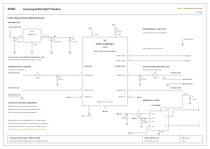

# Samsung transparency bridge — hardware, Rev A

**Рабочая принципиальная схема Samsung UART bridge и Modbus RS485.**

Здесь находятся электрическая принципиальная схема и база компонентов для PCB.
Это не законченная разводка печатной платы.

Контроллер включается между основной платой Samsung и штатной платой дисплея/Wi-Fi.
Прозрачный UART-мост предназначен для сохранения полного заводского функционала
с добавлением Wi-Fi, HTTP Remote, MQTT и Modbus RTU/TCP от 4VRS. Диспетчер очереди
опроса и команд на ESP32 согласует собственные запросы со штатным обменом.
Дисплей, ИК-пульт и SmartThings проверены на AR24BSFCMWKNER; это не означает
завершения проверки каждой заводской функции. Подробности — в README проекта.

## Электрическая схема

- [PDF, два листа A3](drawings/Samsung_transparency_bridge_revA-review.pdf).
- [SVG, схема](drawings/Samsung_transparency_bridge_revA-sheet1.svg).
- [SVG, соединения и перечень элементов](drawings/Samsung_transparency_bridge_revA-sheet2.svg).

Первый лист содержит питание, ESP32 и два направления UART-моста, а также MAX485.
Второй разделяет номера GPIO, физические контакты ESP32 и контакты CN1 Samsung.
На чертеже не воспроизводится механическое расположение контактов разъёмов.

Соединения:

- C2, 47 мкФ / 6,3 В, подключён между +3V3 и GND, плюс к +3V3.
- C3, 0,1 мкФ, тоже подключён между +3V3 и GND, **не к EN**.
- EN подтянут к +3V3 через R1, 10 кОм.
- MAX485: SOIC-8. Резисторы и неполярные конденсаторы: 0805.
- Повторное обозначение R6 для подтяжки DE заменено на R8.
- Конденсаторам присвоены уникальные C1–C4; прежние рукописные номера не сохранялись.

## База для PCB

| Файл / каталог | Назначение |
|---|---|
| `components/BOM.csv` | 15 элементов, номиналы, символы и посадочные места |
| `components/components.json` | Та же база в структурированном виде |
| `components/connections.csv`, `nets.json` | 18 сетей и номера выводов компонентов |
| `components/external_connections.csv` | Соединение будущих разъёмов с CN1 и RS485 |
| `kicad/4vrs_Samsung.kicad_sym` | Шесть символов KiCad: ESP32, AMS1117, MAX485, R, C, CP |
| `kicad/4vrs_Samsung.pretty` | Пять официальных посадочных мест Espressif / KiCad |
| `kicad/sym-lib-table`, `fp-lib-table` | Локальные таблицы библиотек для проекта в `hardware/kicad` |
| `kicad/Samsung_bridge_review.net` | XML netlist для подготовки PCB, без невыбранных разъёмов |
| `tools/` | Исходники генераторов чертежа и базы |

Для нового проекта KiCad в каталоге `hardware/kicad` библиотеки используют
`${KIPRJMOD}`. При переносе проекта в другой каталог нужно изменить пути таблиц.
Файл `.kicad_sch` и разводка `.kicad_pcb` на этом этапе не создавались.
PDF/SVG редактируются через генератор, библиотеки — через KiCad.

Посадочные места сохранены без изменения из первоисточников. Ссылки и SHA-256
находятся в `kicad/footprint_sources.json`; лицензии — рядом с библиотеками.
3D-модели не копировались; ссылки в footprints могут требовать стандартных
3D-библиотек KiCad/Espressif. Это не влияет на геометрию контактных площадок.

## Что уточнить перед разводкой

1. Размеры и тип монтажа полярного C2. Его footprint намеренно не назначен.
2. Подтверждение корпуса AMS1117: в базе предложен SOT-223 с tab = OUT.
3. Серии, шаг, ориентация и число контактов собственных разъёмов платы.
   Контакты CN1 на чертеже — контакты кондиционера, не готовая распиновка PCB-разъёма.
4. Размер платы, монтажные отверстия, ориентация шлейфов и антенны модуля.
5. Допуски / мощность резисторов и рабочее напряжение керамических конденсаторов.

EP41 ESP32 включён в GND по документации модуля. GPIO35/36/37 в варианте
N16R8 зарезервированы под PSRAM и в библиотеке помечены как не подключаемые.
Добавлены линии программатора: GPIO43 (pad37) → RX адаптера, GPIO44 (pad36) ← TX адаптера, общий GND. Уровни адаптера: 3,3 В. Это три сигнальных соединения, не схема автоматического входа в загрузчик: для UART-загрузки нужен GPIO0 на GND во время сброса EN. Защита и терминатор RS485 пока не добавлены.

Ревизия чертежа: C4 напрямую соединён с +5V вывода 8 MAX485 и GND; R1 расположен непосредственно над EN (вывод 3 U1), без обходного провода; C2 и C3 подключены к общей линии +3V3 выхода стабилизатора. Одноимённые метки остальных сетей обозначают электрическое соединение.

## Проверки

PDF отрисован и просмотрен по листам. Генератор проверяет уникальность назначения
выводов сетям и наличие выводов в символах. Отдельно сверены наборы номеров pad
официальных footprints и символов. Проверена распиновка GPIO17/18, GPIO15/16,
GPIO9/8/21 относительно основной прошивки.

KiCad CLI в текущем окружении отсутствует: открытие библиотек / импорт netlist,
ERC и DRC в KiCad ещё не выполнялись. Отсутствие ошибок структурной проверки
не является подтверждением готовности к производству.

## Источники

- [Espressif ESP32-S3-WROOM-1 datasheet](https://www.espressif.com/sites/default/files/documentation/esp32-s3-wroom-1_wroom-1u_datasheet_en.pdf).
- [MAX485, Analog Devices](https://www.analog.com/en/products/max485.html).
- [AMS1117, документ производителя в архиве LCSC](https://datasheet.lcsc.com/lcsc/1811142212_Advanced-Monolithic-Systems-AMS1117-3-3_C6186.pdf).
- [Официальная библиотека Espressif](https://github.com/espressif/kicad-libraries).
- [Библиотеки KiCad: условия использования](https://www.kicad.org/libraries/license/).

Документация компонентов использована для обозначений выводов и посадочных мест.

Обозначения внешних цепей: `controller mb` — основная плата кондиционера (motherboard); `display CN1` — разъём платы дисплея. Обе платы подключены к общей линии +5V и GND. TX/RX обозначены относительно соответствующей платы.
